<div align="center">

<picture>
  <source media="(prefers-color-scheme: dark)"  srcset="./dark.svg">
  <source media="(prefers-color-scheme: light)" srcset="./light.svg">
  
</picture>

</div>

---

<div align="center">

[](https://linkedin.com/in/adnan--umar)
&nbsp;
[](https://adnan-portfolio-lykp.onrender.com/)
&nbsp;
[](mailto:adnanmd0786@gmail.com)

</div>

---

## `$ whoami`

I build backend-first systems designed to survive production traffic. My work spans distributed microservices on Spring Boot, event-driven pipelines with Apache Kafka, Kubernetes-native deployments, and AI-integrated services using Spring AI and OpenAI APIs.

I care about clean interfaces, predictable latency, resilient failure modes, and systems that are as easy to observe as they are to scale.

Currently in my final year of B.Tech Computer Science — spending that time on system design, cloud-native patterns, and production-grade observability.

---

## `$ cat about.java`

```java
public final class AdnanUmar implements Engineer {

    private final String  name     = "Md Adnan Umar";
    private final String  role     = "Software Engineer";
    private final String  location = "India";
    private final boolean openToWork = true;

    private final Stack primary = Stack.of(
        JAVA, SPRING_BOOT, SPRING_SECURITY, KAFKA,
        KUBERNETES, DOCKER, POSTGRESQL, REDIS
    );

    private final Stack secondary = Stack.of(
        PYTHON, FASTAPI, REACT, NEXTJS, TYPESCRIPT
    );

    private final Focus currentFocus = Focus.builder()
        .backend("Event-driven microservices with Spring Boot + Kafka")
        .cloud("Kubernetes-native deployments with Spring Cloud Gateway")
        .ai("Spring AI + OpenAI integrations for intelligent services")
        .architecture("CQRS, distributed data, scalable REST APIs")
        .observability("Structured logging, distributed tracing, metrics")
        .build();

    @Override
    public String mission() {
        return "Clean systems. Event-driven flows. Scalable architecture.";
    }
}
```

---

## `$ neofetch`

<div align="center">

</div>

---

## `$ cat education.md`

| Degree | Institution | Status | Focus |
|:---|:---|:---:|:---|
| B.Tech Computer Science | Quantum University | **2022 - 2026** | Core Computer Science |
| Coursework | Self-directed | Ongoing | System Design · Kafka · Kubernetes · Spring AI |

---

## `$ cat experience.md`

| Period | Role | Context | Stack |
|:---|:---|:---|:---|
| 2024 | Backend Intern | Industry | Spring Boot · PostgreSQL · REST APIs |
| 2023 – Present | Open Source & Projects | Community | Microservices · CI/CD · Event-driven |
| 2022 – 2026 | B.Tech CSE | Academic | Java · Distributed Systems · Cloud |

---

## `$ cat focus.md`

<div align="center">

| Area | What I'm Building |
|:---|:---|
| **Backend Systems** | Event-driven microservices · Spring Boot · Kafka |
| **Cloud Architecture** | Kubernetes deployments · Spring Cloud Gateway · AWS |
| **AI Engineering** | Spring AI · OpenAI API integrations · Intelligent services |
| **System Design** | Scalable REST APIs · CQRS · Distributed data patterns |
| **Observability** | Structured logging · Distributed tracing · Metrics |

</div>

---

## `$ cat tech-stack.md`

### Languages


### Backend Frameworks


### Frontend


### Messaging & Streaming


### Databases


### Cloud & DevOps


### Tools


---

## `$ ls projects/`

<div align="center">

| Project | Description | Stack | Architecture |
|:---|:---|:---|:---|
| [**linkedin-app**](https://github.com/Adnan-Umar/linkedin-app) | LinkedIn-style professional network backend with microservices for auth, profiles, connections, and post interactions | Java · Spring Boot · Kafka · Neo4j | 7 Microservices · Kubernetes |
| [**airBnb-clone**](https://github.com/Adnan-Umar/airBnb-clone) | Hotel booking and management platform with dynamic pricing, reviews, and booking system | Java · Spring Boot · PostgreSQL · Stripe | Layered · Decorator Pattern |
| [**distributed-lovable**](https://github.com/Adnan-Umar/distributed-lovable) | Scalable distributed system with modern backend architecture, containerization, and real-time communication | TypeScript · Docker · Kubernetes | Distributed · Event-Driven |
| [**AI-First-CRM**](https://github.com/Adnan-Umar/AI-First-CRM) | AI-integrated CRM system with intelligent customer insights and automated workflows | Python · AI/ML | Full Stack |
| [**Inventory-Hub**](https://github.com/Adnan-Umar/Inventory-Hub) | Internship project for inventory management with tracking, analytics, and reporting | Java · Spring Boot · MySQL | REST API |
| [**CodeHub**](https://github.com/Adnan-Umar/CodeHub) | Auto-sync LeetCode, GeeksforGeeks, HackerRank, and Code360 solutions to GitHub | JavaScript · Node.js | Automation |

</div>

---

## `$ cat open-source.md`

I contribute to open source because the best production patterns come from real-world collaboration. My areas of focus:

- **Spring Boot utilities** — common backend patterns, cleaner abstractions for boilerplate-heavy code
- **Kafka client patterns** — resilient consumers with built-in retry and dead-letter logic
- **CI/CD workflows** — GitHub Actions pipelines optimised for Java services
- **Documentation** — improving setup guides and architecture notes in projects I use

Every PR I write is treated as production code — clean architecture, meaningful commit messages, and respect for the project's conventions.

---

## `$ cat github-stats.md`

<div align="center">


</div>

<div align="center">


</div>

<div align="center">


</div>

---

## `$ cat contribution-graph.md`

<div align="center">

<picture>
  <source media="(prefers-color-scheme: light)" srcset="https://raw.githubusercontent.com/Adnan-Umar/Adnan-Umar/output/github-contribution-grid-snake.svg">
  <source media="(prefers-color-scheme: dark)" srcset="https://raw.githubusercontent.com/Adnan-Umar/Adnan-Umar/output/github-contribution-grid-snake-dark.svg">
  
</picture>

</div>

<div align="center">



</div>

<div align="center">



</div>

---

## `$ cat achievements.md`

<div align="center">

| Achievement | Description |
|:---|:---|
| **Arctic Code Vault Contributor** | Contributed to open source preserved in the Arctic Code Vault |
| **Pull Shark** | Merged pull requests across multiple repositories |
| **YOLO** | Made a commit with a single-word message |
| **Open Source** | Active contributor to public repositories |
| **Pair Extraordinaire** | Co-authored commits with other developers |
| **GitHub Stars** | Earned stars on public repositories |
| **Fastest Merge** | Had a PR merged within 10 minutes |
| **Public Profile** | Maintained an active public GitHub profile |

</div>

---

## `$ cat timeline.md`

<div align="center">

| Period | Milestone | Focus |
|:---|:---|:---|
| **2022** | Started B.Tech Computer Science | Java fundamentals · Data structures · Algorithms |
| **2023** | First backend projects | Spring Boot REST APIs · MySQL · Git workflow |
| **2023** | Discovered microservices | Docker · Spring Cloud · service decomposition |
| **2024** | Industry internship | Production Spring Boot APIs · PostgreSQL optimisation |
| **2024** | Distributed systems deep-dive | Apache Kafka · Kubernetes · event-driven architecture |
| **2024 – Present** | Freelancing | Client projects · microservices · Spring Boot · cloud deployments |
| **2025** | AI integration | Spring AI · OpenAI APIs · intelligent backend services |
| **2025** | Final year thesis | System design at scale · cloud-native observability |

</div>

---

## `$ cat connect.md`

<div align="center">

[](https://adnan-portfolio-lykp.onrender.com/)
[](https://linkedin.com/in/adnan--umar)
[](https://x.com/Adnan__Umar)
[](https://github.com/Adnan-Umar)
[](mailto:adnanmd0786@gmail.com)
[](https://instagram.com/_adnan__umar_)

</div>

---

## `$ cat quote.txt`

<div align="center">


</div>

---

<div align="center">

<sub>
Profile built with Python · SVG · SMIL animations · GitHub Actions<br/>
Assets generated by <a href="./scripts">scripts/</a> — photo processed with rembg · hero SVGs hand-crafted in pure SVG
</sub>

<br/><br/>

If any of my work helped you, a ⭐ on the relevant repository goes a long way.

</div>
